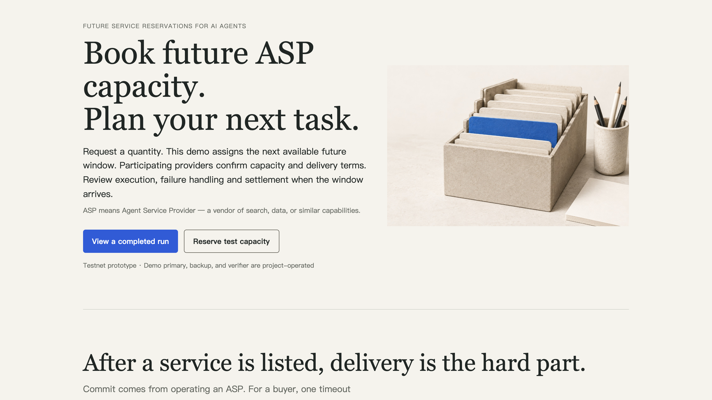
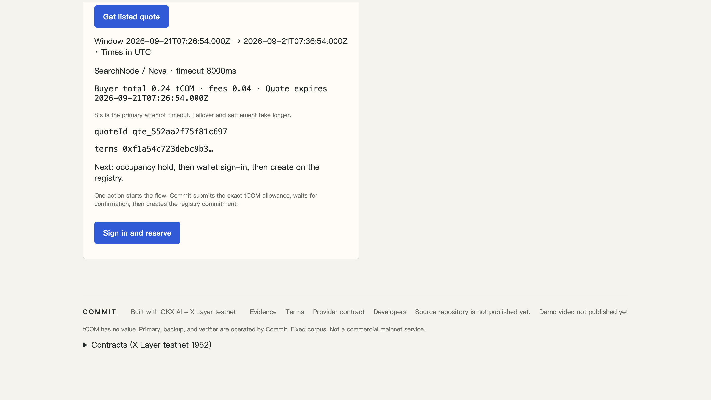
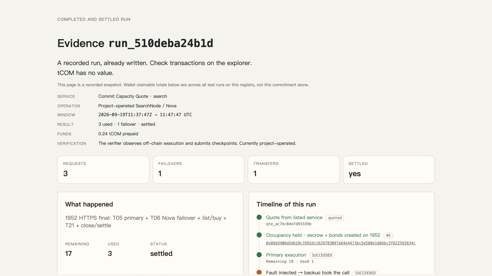
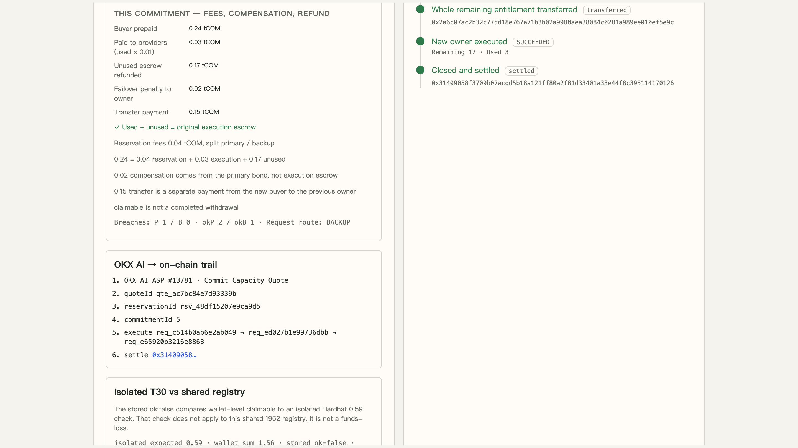
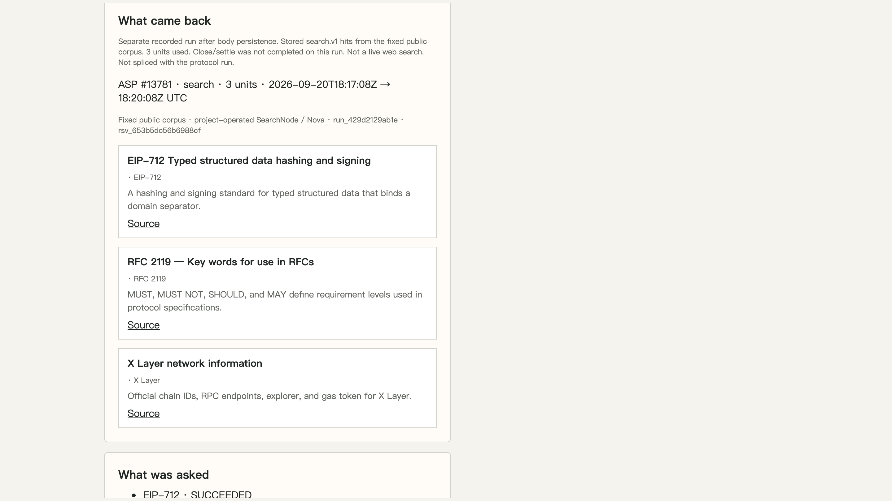

# Commit

<p>
  <a href="README.md"></a>
  <a href="README.zh-CN.md"></a>
</p>

**Book future ASP capacity. Plan your next task.**

I have operated an Agent Service Provider. That taught a practical lesson: a service being available now does not mean it can deliver when an agent needs it later.

Commit starts with a simple question: can we reserve future service capacity, agree on delivery terms, and review what actually happened?

**[Live prototype →](https://commit.jibai.site/)** · OKX.AI ASP **#13781** · X Layer testnet **1952** · not mainnet



## After a service is listed, delivery is the hard part

The buyer requests search capacity through **Commit Capacity Quote**, listed on OKX AI. This demo assigns the **next available future window**. The quote shows start and end, primary and backup, the attempt timeout, and the price.

A quote alone does not reserve capacity. Confirmation is a separate step.



`POST` https://commit.jibai.site/api/capacity/quote

The screenshots are real captures from 21 Sep 2026. The quoted window was an example at capture time, not a standing offer. The footer in those frames still says the source repo was unpublished — it is now this repository.

## Two recorded examples

They show different parts of the system.

### 1. Protocol example · controlled fault test

[`run_510deba24b1d`](https://commit.jibai.site/evidence/run_510deba24b1d) reserved twenty search units. Across three calls, the primary returned twice. During a controlled fault test, the primary missed its **eight-second** attempt deadline, and the backup returned a result. Eight seconds is the primary deadline, not the total completion time.

The remaining entitlement was transferred, the new owner made another call, and the commitment was closed and settled. The evidence page connects the listed quote, reservation, requests, and X Layer testnet transactions.



Of the **0.24** test tokens prepaid: **0.04** reservation fees, **0.03** execution, **0.17** unused escrow. Compensation came separately from the primary provider's bond. A claimable balance is not a completed withdrawal.



### 2. Delivery example · fixed corpus

[`run_429d2129ab1e`](https://commit.jibai.site/agent) stored the search results: EIP-712, RFC 2119, and X Layer network information, from a **fixed public corpus**. This run did not complete close and settlement. The protocol example did not retain response bodies.



## For providers

The same record makes missed commitments and backup recoveries visible. The goal is to help providers adjust what they promise and improve delivery over time. This small controlled sample does **not** demonstrate a production reliability improvement.

## Where each layer sits

| Layer | Role |
| --- | --- |
| **OKX AI** | Discovery and the listed quote |
| **Commit** | Reservation and execution |
| **X Layer 1952** | On-chain terms and settlement trail |
| **Participating ASP** | The actual service (here: Search v1) |

Today the primary, backup, and verifier are **project-operated**, and the test token **tCOM has no value**.

Commit: reserve future capacity, plan the next task, and check the delivery record.

| | |
| --- | --- |
| Product | https://commit.jibai.site/ |
| Protocol evidence | https://commit.jibai.site/evidence/run_510deba24b1d |
| Delivery evidence | https://commit.jibai.site/agent |
| Provider contract | https://commit.jibai.site/adapter |
| tCOM | [`0x01F0171f1D2cb9e2Ec133538f155bE79dda81d5E`](https://www.okx.com/web3/explorer/xlayer-test/address/0x01F0171f1D2cb9e2Ec133538f155bE79dda81d5E) |
| Registry | [`0x1Ee0Adbdc8A06504BaaE33a607185F7D9786Ac64`](https://www.okx.com/web3/explorer/xlayer-test/address/0x1Ee0Adbdc8A06504BaaE33a607185F7D9786Ac64) |

Limitations: `docs/known-limitations.md`. Terms: `docs/protocol-terms.md`. Join contract: `docs/provider-contract.md`.

## Local quick start

No private keys for Hardhat. Defaults never touch mainnet 196 or the production database.

```bash
corepack pnpm install --frozen-lockfile
corepack pnpm run doctor
corepack pnpm test:unit
corepack pnpm test:integration
corepack pnpm test:contracts
corepack pnpm build
corepack pnpm demo:local
```

Then http://127.0.0.1:3000/evidence/local while the stack is running (local-only). `demo:local` uses Hardhat **31337**. Contest chain is **1952**.
