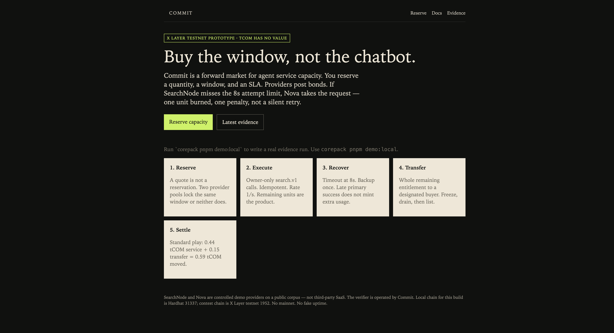

# Commit

**预订未来一段时间的 Agent 服务容量**（窗口、数量、SLA）。主服务商超时未交付时，已缴保证金的备用服务商接手。

Reserve a **future agent-service window** — quantity and SLA — with **bonded backup** when the primary misses.

This is the public source of the OKX.AI **live testnet** product (Singapore Finale, 7 Oct 2026). HTTPS + X Layer **1952** funds are real. **tCOM has no value.** SearchNode and Nova are project-operated. The verifier is operated by Commit. **Not commercial mainnet 196.**

A quote is not a reservation. A cron can remind you to call; it cannot invent a free seat. Occupancy is exclusive — a second create on the same window returns `NO_CAPACITY`.

## For judges · 评委先看这里

| | |
| --- | --- |
| Live product 产品 | https://commit.jibai.site/ |
| Stored search hits 检索交付样例 | https://commit.jibai.site/agent · evidence [`run_429d2129ab1e`](https://commit.jibai.site/evidence/run_429d2129ab1e) |
| Protocol play 故障切换 + 转让 + 结算 | https://commit.jibai.site/evidence/run_510deba24b1d |
| Provider contract 服务商契约 | https://commit.jibai.site/adapter |
| OKX AI listed quote 已上架报价 | ASP **#13781** · `POST` https://commit.jibai.site/api/capacity/quote |
| tCOM (6 decimals, no value) | [`0x01F0171f1D2cb9e2Ec133538f155bE79dda81d5E`](https://www.okx.com/web3/explorer/xlayer-test/address/0x01F0171f1D2cb9e2Ec133538f155bE79dda81d5E) |
| Registry | [`0x1Ee0Adbdc8A06504BaaE33a607185F7D9786Ac64`](https://www.okx.com/web3/explorer/xlayer-test/address/0x1Ee0Adbdc8A06504BaaE33a607185F7D9786Ac64) |
| Sourcify | exact_match on both contracts |
| Demo video 演示视频 | not published yet |
| This repo 本仓库 | public source for the product above |

**Do not splice the two recorded runs / 两条记录不要拼成一笔：**

- `run_429d2129ab1e` — search.v1 bodies stored (delivery artifact)
- `run_510deba24b1d` — same-runId failover → transfer → settle (protocol)



### What this repo is / 仓库里有什么

Source for the live product: Next.js workbench, quote API, occupancy, X Layer contracts, tests, and the evidence notes for the two runs above.

Gitignored on purpose: wallets, `.env`, `.local/` (deploy keys, TAT runner), `node_modules`, raw evidence dumps. Local demo does not need those files.

### What this is not / 明确不是

Not a spot chat wrapper. Not mainnet. Not x402. Not partial entitlement splits. Not decentralized arbitration. SearchNode / Nova are controlled demo providers on a fixed corpus.

## Why not a cron / spot call

Agents can call services on demand, but a scheduled workflow needs **capacity at a specific future window**. Spot chat does not lock inventory, SLA, or collateral. Commit holds quantity + window + SLA, with two bonded providers.

OKX AI is the listed quote entry (#13781). X Layer 1952 holds escrow, bonds, checkpoints, transfer and settle.

## Scope (P0)

Single service class (Search v1), two controlled providers, free quote, X Layer testnet **1952**, whole remaining entitlement transfer, public evidence page.

## Quick start (local)

No private keys required for Hardhat. Defaults never connect mainnet 196 or the production database.

```bash
corepack pnpm install --frozen-lockfile
corepack pnpm run doctor
corepack pnpm test:unit
corepack pnpm test:integration
corepack pnpm test:contracts
corepack pnpm build
corepack pnpm demo:local
```

Then open http://127.0.0.1:3000/evidence/local while the demo stack is still running (`/evidence/local` is **local-only**, not a public URL).

- SearchNode: http://127.0.0.1:3042/health
- Nova: http://127.0.0.1:3043/health
- API: http://127.0.0.1:3080/api/health
- Web: http://127.0.0.1:3000

A quote does not reserve. Occupancy is PGlite. `demo:local` boots **Hardhat 31337**, deploys tCOM + registry, then execute → failover → transfer → settle **on chain**. Contest chain is 1952.

## Terms and funds

See `docs/protocol-terms.md`. Standard **buyer create** is **0.24 tCOM** (`20 × 0.01 + 0.02 + 0.02`). Local Hardhat T30 conserved sum (including bonds + 0.15 transfer) is **0.59 tCOM** — that is a different number. Verifier is centralized (disclosed). Deployed `PenaltyAccrued.id` is always `0` (see known limitations).

## Official integration

See `docs/OKX-INTEGRATION.md`. Free HTTPS quote is live. ASP **#13781** is listed. User-side T31 consumed a listed-service `quoteId` into reservation create (`evidence/t31-user-side.md`).

## Tests

`docs/QA_REPORT.md` maps T01–T31 including replay (T28) and restore (T34). T32 is the remaining phone-device look.

## Deploy

`docs/deployment.md` and `docs/runbook.md`. Staging is an extra Caddy site on Tokyo. Do not touch `alpha.jibai.site` / `game.jibai.site` / port 3001.

## Limitations

`docs/known-limitations.md`.

## Docs index

- Spec: `docs/HANDBOOK.md`
- Architecture: `docs/architecture.md`
- Status: `PROJECT_STATUS.md`
- Submission drafts: `submission/`
- Build-period notes: `docs/build-period-work.md` (this tree is new; not a rewrite of `commit-protocol/`)
